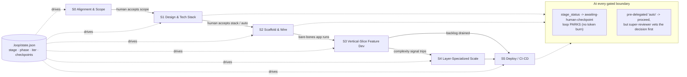

# Roadmap: Lifecycle-Staged Autonomous Build Loop

> Strategic roadmap of record. Each milestone gets its own implementation plan/PR later.
> Milestone *execution* happens in the user's local dev environment (testbed paths and most
> dependencies live there, not in this repo).

## Context

The `claude-skills` repo ships two paired skills that work today:

- **`autonomous-build-loop`** — the *runtime* protocol: per-iteration 13-step checklist, tiered
  reads, fat-iter parallel dispatch, Class A/B sub-agents, peer-review triggers, phase-boundary
  arch-pass, continuous-loop (no-halt) semantics. Runs in two modes — in-session (`ScheduleWakeup`)
  and external-scheduler (`EXTERNAL_SCHEDULER=1`, driven by `auto-loop.py` + `claude -p`).
- **`auto-loop-bootstrap`** — the *scaffolding* skill: audits a repo, grills for a backlog,
  scaffolds `CLAUDE.md`/`GOALS.md`/`ARCHITECTURE.md`/`PLAN.md`/`logs/`, drops in `auto-loop.py`,
  smoke-tests one iter.

They cover the **middle** of a development lifecycle (feature implementation) well, but nothing
before it. Research into senior-dev AI workflows — Arjay McCandless (Design → PRD → Build → Review
→ Deploy) and Matt Pocock (Grill → PRD + vertical-slice Kanban → TDD AFK loops → human QA +
automated review) — plus a read of the installed skill library exposes concrete gaps:

1. **No lifecycle model.** No alignment/scope stage, no tech-stack *selection*, no
   "scaffold-and-wire until the bare-bones app runs" stage. `auto-loop-bootstrap` only *captures*
   a pre-decided stack and never verifies the scaffolded app is runnable.
2. **No branch/PR model.** The loop commits straight to one branch. PRs should be vertical-slice
   feature implementations.
3. **The rich skill library is unused.** Grilling, prototyping, TDD, fresh-context review,
   debugging, arch passes — none are wired into the loop.
4. **No human path for visual verification, no decision log, no research discipline.**
5. **Minor naming snag:** `references/read-manifest.md` is a *read-strategy* doc, not a state
   file — the name invites confusion with the actual state file (`logs/latest.md`).

**Intended outcome:** evolve the two skills into a **lifecycle-staged loop** that knows which
*stage* it is in (via a real machine-readable state file), behaves differently per stage, invokes
the right existing skill per stage, takes human checkpoints at stage boundaries (visual review via
Telegram), ships feature-PRs reviewed by a fresh-context super-reviewer (+ CodeRabbit when
available), keeps a decision log, and uses auto-research to replace training-data guesswork.
Proven on a purpose-built testbed; **ARK (the user's production app at iter-222) is
observation-only and is not migrated.**

---

## Target architecture

### 1. Lifecycle Stages

"Phase" (P1/P2…) is already taken — it means feature-backlog phases *within* development. New
concept: **Stage** — a coarse lifecycle position. Waterfall *between* stages, agile *within* each.

| Stage | Name | Human | Owning skill | Exit gate |
|---|---|---|---|---|
| **S0** | Alignment & Scope | Heavy | `auto-loop-bootstrap` | Scope/PRD doc + `GOALS.md` backlog; **human accepts scope** |
| **S1** | System Design & Tech Stack | Checkpoint | `auto-loop-bootstrap` | `ARCHITECTURE.md` filled (stack + data model + bottlenecks); **human accepts stack** (or pre-delegates "auto") |
| **S2** | Scaffold & Wire | Light (keys/accounts) | `auto-loop-bootstrap` | Bare-bones app **actually runs** + integrations wired |
| **S3** | Vertical-Slice Feature Dev | AFK | `autonomous-build-loop` | Backlog drained; each feature = a DB+backend+frontend slice shipped as one PR. Fat PRs OK here. |
| **S4** | Layer-Specialized Scale | AFK | `autonomous-build-loop` | Triggered by composite complexity signal; sub-agents specialize by layer, slices stay vertical, PRs become smaller/scoped |
| **S5** | Deploy / CI-CD | Checkpoint | `autonomous-build-loop` | CI/CD live; merged PRs deploy |
| *S6* | Maintenance / backlog mode | — | future scope | — |

### 2. Stage flow



`auto-loop-bootstrap` owns S0→S2; `autonomous-build-loop` owns S3→S5. The canonical stage
definitions live in one new file — `autonomous-build-loop/references/lifecycle-stages.md` — and
`auto-loop-bootstrap` references it (no duplication).

### 3. Loop State file — split model (machine state + human handoff)

`logs/latest.md` is **already** the loop's state file (Tier-1, 30-line hard cap, prettier-stable,
overwritten each iter). It mixes machine fields and prose handoff. The refinement **splits** it:

- **New `.loop/state.json`** — machine-readable, Tier-1, **committed to git**. Authoritative for
  stage/phase/iter/flags. Supersedes the informal `Phase:` line in `latest.md`.
- **`logs/latest.md` stays** — the human-readable handoff (next step, files to open, open blocks,
  carry-forward, last-iter summary). Its `Phase:` line is **removed** (JSON owns it); the rest of
  the prettier-stable format is unchanged. `log-hygiene.md`'s format spec must be updated to match.
- `references/read-manifest.md` is **renamed `tiered-read-strategy.md`** — it was always a read
  *strategy*, never a manifest. Blast radius (every reference to update): `autonomous-build-loop/
  SKILL.md` (lines 12, 29, 90), `autonomous-build-loop/references/per-iteration-checklist.md`
  (line 8), `auto-loop-bootstrap/assets/templates/CLAUDE.md` (line 25), `README.md` (line 9).

```jsonc
// .loop/state.json
{
  "stage": "S3", "stage_status": "in-progress",   // in-progress | awaiting-human-checkpoint | complete
  "phase": "P2", "iter": 47,
  "checkpoints": { "scope-accepted": "passed", "tech-stack-accepted": "auto-delegated" },
  "complexity_signal": { "loc": 8400, "files": 112, "stage4_triggered": false },
  "pr_mode": true, "pr_size_policy": "fat",        // fat (S3) | scoped (S4)
  "multi_loop": { "workers": 1, "queue": "logs/task-queue.md" }
}
```

Naming note to resolve in M1: the repo already gitignores `/.auto-loop/` (the `auto-loop.py`
runtime dir). The new `.loop/` dir holds **committed** state (`state.json`) plus **gitignored**
ephemera (`.loop/claims/` for multi-loop atomic claims). Keep the two dirs distinct and document
the split; add `/.loop/claims/` to the `.gitignore` template.

### 4. Human checkpoints — reconciled with "never halt"

- **Checkpoints are stage-gated, not iter-gated.** *Within* a stage, continuous-loop semantics are
  untouched — no halt, no questions.
- At a gated boundary, `stage_status` flips to `awaiting-human-checkpoint`; the loop **parks**
  (re-checks on wake-up, no token burn). If the human pre-delegated (`"auto-delegated"`), the
  agent proceeds — but the decision is **super-reviewed** first (§6).
- **Verification split:** non-visual → **TDD** (autonomous, failing-test-first). Visual → **human**.
  Visual checkpoints notify the human via **Telegram** (bot sends the screenshot, human replies
  in-channel, loop continues — fire-and-forget). The Telegram bot is a backlog item (M-Tel), not
  built up front. Reference research: Telegram Bot API `sendPhoto` + webhook/polling for replies;
  wired via a Claude Code `PostToolUse`/`Stop` hook.

### 5. Skill integration map — **vet before depending on (M0)**

The current skills reference only `improve-codebase-architecture`, `grill-me`, and
`superpowers:brainstorming` (and mention `to-issues`/`to-prd`). The architecture below assumes
~20 more skills exist. **M0 vets which are actually installed** and the plan degrades gracefully
where one is missing — no skill is load-bearing without a fallback.

| Stage | Skills (vet in M0) | Fallback if missing |
|---|---|---|
| **S0** | `grill-with-docs`, `grill-me`, `superpowers:brainstorming`, `prototype` (end of S0), `to-prd` | manual Q&A bank (already in `grilling-guide.md`) |
| **S1** | `to-issues`, `superpowers:writing-plans`, **auto-research** (§7) | manual decomposition; agent recommends from training data with explicit caveat |
| **S2** | `superpowers:using-git-worktrees`, `superpowers:executing-plans`, **auto-research** | inline execution; manual setup-doc reads |
| **S3/S4** | `tdd` / `superpowers:test-driven-development`, `superpowers:subagent-driven-development`, `dispatching-parallel-agents`, `coderabbit:code-review` + `coderabbit:autofix`, `superpowers:requesting-code-review`, `superpowers:receiving-code-review`, `superpowers:verification-before-completion`, `superpowers:systematic-debugging` / `diagnose`, `improve-codebase-architecture` | existing fat-iter dispatch + Class A peer-review sub-agent already cover the spine; **CodeRabbit is pluggable, not required** |
| **Lifecycle-wide** | `claude-md-management:claude-md-improver`, `superpowers:writing-skills` | manual promotion of decision-log entries |

### 6. Super-reviewer for auto-delegated decisions

Every auto-delegated checkpoint decision (and every feature PR) is vetted by a **fresh-context
super-reviewer** — no session bias, whole-repo context. Implemented via
`superpowers:requesting-code-review` (or a Class A sub-agent if that skill is absent), dispatched
with a **repo-context pack**: `ARCHITECTURE.md` + decision log + ADRs + `CONTEXT.md`. New
reference: `autonomous-build-loop/references/super-reviewer.md`.

### 7. Auto-research mode

New reference `autonomous-build-loop/references/auto-research-mode.md` — the Anthropic multi-agent
research pattern: dispatch 3–5 Class A (read-only + web/`context7` MCP) research sub-agents in
parallel, each returns *condensed* findings, lead agent synthesizes → persists to
`docs/research/<topic>.md`. Replaces guesswork in: S1 tech-stack selection, S2 integration wiring,
S3 library-API confirmation, and the M5 skill-review loop's scan for new community practices.

### 8. Decision log

New `docs/decision-log.md` (template asset) — append-only, lighter than ADRs. Every judgment call
on a *best practice* (naming convention, error-handling pattern, folder structure, lib choice)
logs: decision, rationale, date/iter. Tier-2 read. The super-reviewer reads it for context;
`claude-md-improver` periodically promotes stable entries into `CLAUDE.md`. `docs/adr/` stays for
big architectural decisions.

### 9. Feature-PR mode + CodeRabbit (S3+)

One PR per feature = one vertical slice. New reference
`autonomous-build-loop/references/feature-pr-mode.md`, gated by `pr_mode`/`pr_size_policy` in
`.loop/state.json`. Per-feature flow: branch off fresh `main` → **TDD** (failing test first) →
implement → `superpowers:verification-before-completion` → push → `gh pr create` →
`coderabbit:code-review` runs *if installed* → loop iter(s) resolve threads via `coderabbit:autofix`
(filtered through `receiving-code-review`) → super-reviewer (§6) → **auto-merge on APPROVE + green**;
`request_changes`/`block` → log, leave PR open, re-queue. **S3 = fat PRs OK; S4 =
`pr_size_policy: "scoped"`.** The existing Class A peer-review sub-agent is the floor when
CodeRabbit is absent.

### 10. Multi-loop / task queue (S3+)

New reference `autonomous-build-loop/references/multi-loop-mode.md`: `logs/task-queue.md` (tasks
from `GOALS.md`) + atomic claim via `mkdir .loop/claims/<id>/` + each worker in its own
`git worktree`. Single-agent = `workers: 1` draining serially.

### 11. Billing constraint (assumption — re-verify before M1)

Web research indicates that from **~June 15, 2026**, programmatic usage (`claude -p`, SDK) moves
to a separate dedicated credit pool at full API rates, while the classic interactive loop
(`/loop` + `ScheduleWakeup`) stays on the subscription pool. **Decision (pending re-verification):**
testbed loops + multi-loop workers run as **interactive `/loop` sessions in git worktrees**, not
`claude -p`. `auto-loop.py` stays a skills-repo asset for external-driver repos. Confirm the dates
before M1 commits to this.

---

## Rollout milestones

Each milestone splits into **skills-repo changes** (this repo) and **testbed changes** (the
local `loop-lab/` container). All implementation is local; the roadmap session ships only this
document.

### M0 — Dependency vetting & rebuild discipline — *do first, ~half day*
- In the local env, enumerate which skills from §5 are actually installed (`/skills` or
  `~/.claude/skills/`). Produce a vetted table; mark fallbacks for every miss.
- Confirm the billing/research assumptions in §11.
- Confirm `coderabbit:*` availability — decides whether M1 wires it in or stubs the hook.
- Establish the build discipline: every skills-repo PR ends with `./scripts/build.sh` +
  committing refreshed `dist/*.skill`.

### M1 — The proof (feature-PR mode + CodeRabbit) — *do next, minimal-on-purpose*
Keep M1 small — it validates the branch/PR/TDD/review spine before the heavier M2.
- **Skills-repo:** add `autonomous-build-loop/references/feature-pr-mode.md`; wire PR + TDD +
  review + `verification-before-completion` steps into `per-iteration-checklist.md` and
  `fat-iter-mode.md`; introduce **minimal** `.loop/state.json` (stage + iter + pr_mode +
  pr_size_policy only); add the `.loop/state.json` template asset + `/.loop/claims/` to the
  `.gitignore` template; rebuild `dist/`.
- **Testbed (local):** create `loop-lab/t1-expense-tracker` (Vite + React + TS + IndexedDB —
  deliberately a different shape than ARK), GitHub remote, minimal `CLAUDE.md`, `GOALS.md`
  (~25 items), `.claude/commands/loop.md` whose step 0 **explicitly invokes the
  `autonomous-build-loop` Skill tool**.
- **Prove:** a loop branches + TDD + PRs + (CodeRabbit if available) + auto-merges per feature on
  a real app.

### M2 — Lifecycle stages S0–S2 — *user-confirmed priority after M1*
- **Skills-repo:** expand `auto-loop-bootstrap/SKILL.md` (thin-S0 → full S0→S1→S2 pipeline;
  writes the initial `.loop/state.json`). New references in `auto-loop-bootstrap/`:
  `tech-stack-selection.md`, `scaffold-and-wire.md`. New references in `autonomous-build-loop/`:
  `lifecycle-stages.md` (canonical stage defs), `auto-research-mode.md`, `super-reviewer.md`,
  `decision-log.md`. Rename `read-manifest.md` → `tiered-read-strategy.md` (+ fix all 5
  referencing files). Reframe `grilling-guide.md` as S0. Update `log-hygiene.md` for the
  `latest.md` split (drop `Phase:` line, add `Stage:` to the iter-log header). Full
  `.loop/state.json` schema + checkpoint/parking logic. New template assets:
  `assets/templates/.loop/state.json`, `assets/templates/.claude/commands/loop.md`,
  `assets/templates/docs/decision-log.md`. Update `assets/templates/CLAUDE.md` (Loop State +
  lifecycle-stage + checkpoint + decision-log sections) and `assets/templates/ARCHITECTURE.md`
  (S1 fills stack + data model + bottlenecks). Rebuild `dist/`.
- **Testbed (local):** point bootstrap at an empty repo; run S0→S1→S2→S3.
- **Prove:** S0 produces a scope doc + backlog (+ a `prototype` runnable); S1 auto-researches +
  recommends a stack with rationale + parks at the accept gate; on accept/auto, S2 scaffolds and
  the **bare-bones app actually serves** before `.loop/state.json` flips to S3; the super-reviewer
  vets any auto-delegated decision.

### M3 — Multi-loop / task queue
- **Skills-repo:** `autonomous-build-loop/references/multi-loop-mode.md`; task-queue +
  atomic-claim + worktree orchestration; rebuild `dist/`.
- **Prove:** N=2–3 parallel interactive workers + clean `workers: 1` fallback; no double-claims,
  disjoint branches, independent PRs.

### M-Tel — Telegram visual-checkpoint bot — *backlog; slot when S0–S2 needs it*
- Create/adopt a Telegram bot: `sendPhoto` for screenshots, polling/webhook for replies, wired via
  a Claude Code hook. Lets the human fire-and-forget until the loop reaches out.
- **Prove:** trigger a visual checkpoint; a screenshot lands in Telegram and a reply resumes the loop.

### M4 — Stages S4 + S5
- **Skills-repo:** S4 layer-specialized dispatch + composite complexity trigger + `pr_size_policy`
  flip to scoped; S5 deploy/CI-CD reference; rebuild `dist/`.
- **Prove:** on a T2 (intermediate) repo, the complexity trigger flips `stage4_triggered`,
  sub-agents dispatch as layer specialists, `pr_size_policy` flips to scoped.

### M5 — Difficulty matrix + skill-review feedback loop
- **Testbed:** T2 + T3 repos; per-repo **scorecard** (iters-to-stage, test pass rate, review
  APPROVE rate, repeated-issue frequency, PR conflict rate, human-intervention count).
- **Skill-review loop:** a scheduled reviewer observing all testbeds + ARK, running a recurring
  auto-research pass for new community skills/practices, porting generic lessons up into
  `claude-skills`. Testbeds = controlled experiments; ARK = production validation
  (**observation-only**).
- **Prove:** scorecards generated; the skill-review loop opens ≥1 concrete skill-improvement PR
  against `claude-skills` from observed friction.

### Sync model
Skill source is symlinked into `~/.claude/skills/` → testbeds consume it live via the explicit
Skill invocation. No copy step. ARK stays on its current protocol, **untouched**.

---

## Critical files

**`autonomous-build-loop/` (modify):**
- `SKILL.md` — lifecycle-stage awareness; `.loop/state.json` as Tier-1; `read-manifest` → rename.
- `references/per-iteration-checklist.md` — `.loop/state.json` in step 1; TDD + branch/PR/review/
  verify steps; rename reference.
- `references/fat-iter-mode.md` — feature → branch + PR; stage-dependent PR size.
- `references/log-hygiene.md` — `latest.md` split (drop `Phase:`); `Stage:` in iter-log header.
- `references/read-manifest.md` → **rename** `references/tiered-read-strategy.md`.

**`autonomous-build-loop/` (new):** `references/feature-pr-mode.md`, `multi-loop-mode.md`,
`lifecycle-stages.md`, `auto-research-mode.md`, `super-reviewer.md`, `decision-log.md`.

**`auto-loop-bootstrap/` (modify):** `SKILL.md` (full S0→S1→S2 pipeline; writes initial
`.loop/state.json`), `references/grilling-guide.md` (frame as S0; produce a scope/PRD doc),
`references/audit-checklist.md` (audit `.loop/state.json`), `assets/templates/ARCHITECTURE.md`
(S1 fills stack + data model + bottlenecks), `assets/templates/CLAUDE.md` (Loop State +
lifecycle-stage + checkpoint + decision-log sections; fix `read-manifest` reference).

**`auto-loop-bootstrap/` (new):** `references/tech-stack-selection.md`,
`references/scaffold-and-wire.md`, `assets/templates/.loop/state.json`,
`assets/templates/.claude/commands/loop.md`, `assets/templates/docs/decision-log.md`.

**Repo-level (modify):** `README.md` (rename `read-manifest` reference; update skill blurbs),
`.gitignore` template handling for `/.loop/claims/`, `dist/*.skill` (rebuilt via
`./scripts/build.sh` at the end of every skills-repo milestone).

**New testbed (local, not this repo):** `loop-lab/t1-expense-tracker/` (M1), empty bootstrap
target (M2), T2/T3 (M4/M5).

**Reuse — no new code, invoke existing skills:** every skill in the §5 integration map.

---

## Open decisions to resolve during implementation

1. **`.loop/` vs `.auto-loop/` naming** — confirm the split (committed `state.json` vs gitignored
   `claims/`) reads cleanly, or pick clearer names.
2. **Billing model (§11)** — re-verify the June 2026 programmatic-usage change before M1 commits
   to interactive-`/loop`-in-worktrees.
3. **CodeRabbit availability** — M0 decides whether M1 wires `coderabbit:*` or ships the hook stubbed.
4. **`lifecycle-stages.md` ownership** — placed in `autonomous-build-loop/` (the runtime skill);
   confirm `auto-loop-bootstrap` referencing it cross-skill is acceptable vs. duplicating.

---

## Verification

Each milestone is proven on a real testbed loop, not asserted:

- **M0:** a written vetted-skills table with fallbacks; billing assumption confirmed or revised.
- **M1:** run the testbed loop ≥5 iters. Each feature: own branch, failing-test-first, PR via
  `gh pr create`, review runs, auto-merge on APPROVE+green, `main` advances cleanly, no branch
  drift. Merged-PR history = the audit trail.
- **M2:** point bootstrap at an empty repo; confirm S0 scope doc + backlog (+ `prototype`
  runnable), S1 auto-research + stack recommendation + park at accept gate, S2 scaffolds and the
  **bare-bones app actually serves** before `.loop/state.json` flips to S3; super-reviewer vets
  auto-delegated decisions.
- **M3:** 2–3 worktree workers + queue; no double-claims, disjoint branches, independent PRs,
  clean `workers: 1` fallback.
- **M-Tel:** a visual checkpoint sends a screenshot to Telegram; a reply resumes the loop.
- **M4:** on a T2 repo, complexity trigger flips `stage4_triggered`, sub-agents dispatch as layer
  specialists, `pr_size_policy` flips to scoped.
- **M5:** scorecards generated per repo; the skill-review loop opens ≥1 concrete improvement PR
  against `claude-skills`.
- **Build discipline:** every skills-repo milestone ends with `./scripts/build.sh` and a committed
  `dist/` refresh.
- **Regression guard:** the ARK loop continues untouched — its protocol files are never edited.
